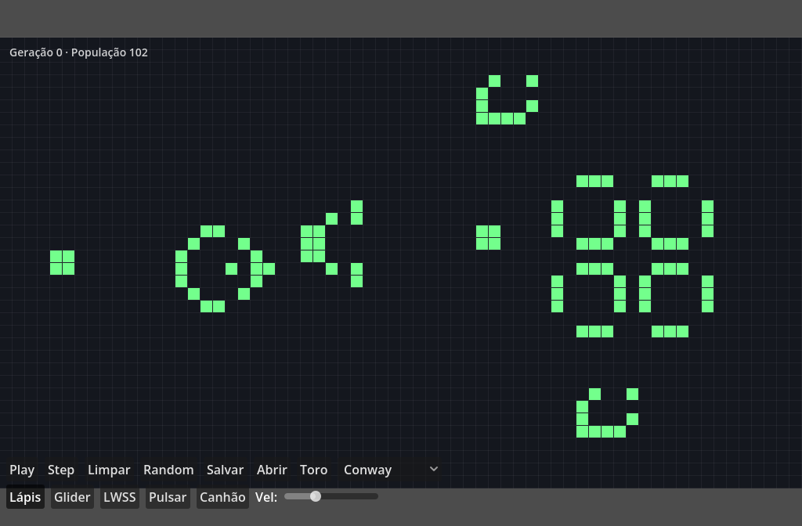

# Jogo da Vida — Godot 4

Implementação do autômato celular de Conway em **Godot 4.7**, feita como projeto de
aprendizado da engine com **TDD desde o primeiro commit** (gdUnit4).



## Recursos

- Simulação completa das regras B3/S23 com *double buffering* e bordas fixas ou toroidais
- Pintura com o mouse: botão esquerdo desenha, direito apaga (funciona pausado ou rodando)
- Padrões clássicos como pincéis: **Glider**, **LWSS**, **Pulsar** e **Canhão de Gosper**
- Botão **Toro**: wrap toroidal — gliders atravessam a borda e reaparecem do outro lado
- Regras alternáveis no dropdown: **Conway**, **HighLife** (B36/S23), **Seeds** (B2/S), **Day & Night**
- Envelhecimento visual: células nascem verdes e envelhecem para o azul
- Zoom (pinça no trackpad / roda do mouse) e pan (dois dedos / botão do meio)
- **Salvar/Abrir** no formato RLE padrão da comunidade (compatível com LifeWiki)
- Gráfico de população ao vivo no canto da grade

## Controles

| Ação | Entrada |
|---|---|
| Pintar / apagar | Botão esquerdo / direito (arraste para pintar) |
| Play/Pause | `Espaço` ou botão |
| Avançar 1 geração | `.` ou botão Step |
| Limpar grade | `C` |
| Aleatorizar | `R` |
| Velocidade | Slider na segunda linha do HUD |
| Zoom / pan | Pinça ou roda · dois dedos ou botão do meio |

## Como rodar

```sh
godot --path .
```

(ou abra o projeto no editor Godot 4.7+ e aperte F5)

## Como testar

O projeto usa [gdUnit4](https://github.com/godot-gdunit-labs/gdUnit4) — 36 testes cobrindo
as regras, contagem de vizinhos, wrap toroidal, idade das células, stamping, codec RLE e
histórico de população.

```sh
GODOT_BIN=$(which godot) sh addons/gdUnit4/runtest.sh -a tests -c
```

## Export Web

```sh
godot --headless --path . --export-release "Web" export/web/index.html
python3 -m http.server 8134 --directory export/web
# abre http://localhost:8134
```

## Estrutura

```
scripts/
  life_simulation.gd   # núcleo puro: regras, toro, idade, histórico (100% testado)
  life_patterns.gd     # catálogo de padrões em ASCII
  rle_codec.gd         # encoder/decoder RLE
  main.gd              # render (_draw), input, câmera, HUD
tests/unit/            # suítes gdUnit4
docs/GDD.md            # game design document
```
